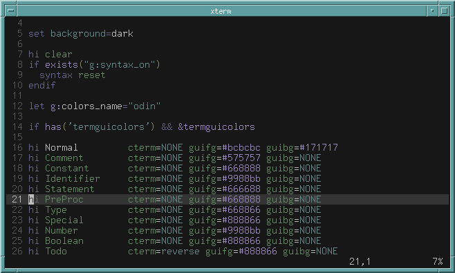

```
              ;                                                                     
       :      ED.                                                                   
      t#,     E#Wi             L.                                                   
     ;##W.    E###G.       t   EW:        ,ft               t                       
    :#L:WE    E#fD#W;      Ej  E##;       t#E               Ej            ..       :
   .KG  ,#D   E#t t##L     E#, E###t      t#E    t      .DD.E#,          ,W,     .Et
   EE    ;#f  E#t  .E#K,   E#t E#fE#f     t#E    EK:   ,WK. E#t         t##,    ,W#t
  f#.     t#i E#t    j##f  E#t E#t D#G    t#E    E#t  i#D   E#t        L###,   j###t
  :#G     GK  E#t    :E#K: E#t E#t  f#E.  t#E    E#t j#f    E#t      .E#j##,  G#fE#t
   ;#L   LW.  E#t   t##L   E#t E#t   t#K: t#E    E#tL#i     E#t     ;WW; ##,:K#i E#t
    t#f f#:   E#t .D#W;    E#t E#t    ;#W,t#E    E#WW,      E#t    j#E.  ##f#W,  E#t
     f#D#;    E#tiW#G.     E#t E#t     :K#D#E    E#K:       E#t  .D#L    ###K:   E#t
      G#t     E#K##i       E#t E#t      .E##E    ED.        E#t :K#t     ##D.    E#t
       t      E##D.        E#t ..         G#E .j t          E#t ...      #G      .. 
              E#t          ,;.             fE ;f.           ,;.          j          
              L:                            ,                                       
```


- *odin in action*

this is a colorscheme that has been sitting in my computer for a little bit, but now revised.<br>
it is pretty heavily inspired by [blaquemagick](https://github.com/xero/blaquemagick.vim), but it's a bit more colorful than the original.

right now, there is only the base syntax set, since i don't know of any other special groups I should add.<br>
please open an [issue](https://github.com/flqwer/odin.vim/issues) if you have any suggestions!

to install, use your favorite plugin manager or drop the file from the `colors/` directory into your `runtimepath/colors` directory.<br>
for example, here's [vim-plug](https://github.com/junegunn/vim-plug):

```vim
call plug#begin()

Plug 'flqwer/odin.vim'

call plug#end()
```

then source the colorscheme file using `colorscheme odin` in your vimrc.
